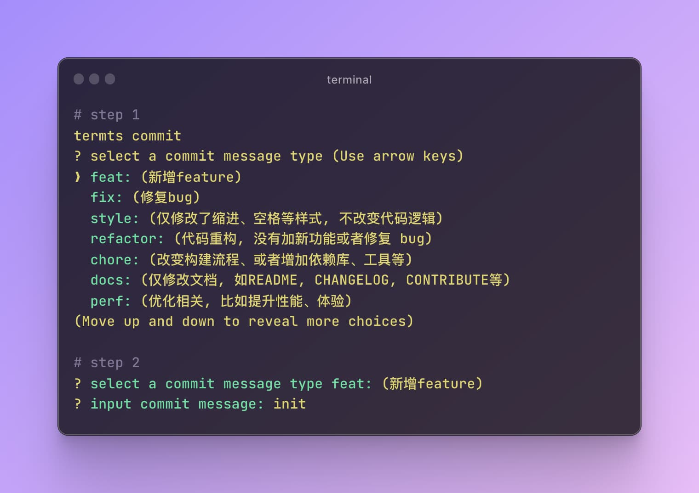

<div align="center">
  
  <h1 align="left">termts</h1>
</div>

> termts 是一个集合，包含小巧而实用的终端脚本工具           

🚧 该仓库已归档, 请使用 [go-termts](https://github.com/CiroLee/go-termts)            

node version need >= **14**

[English](README.md) | 简体中文

# 安装

```shell
# npm
npm install -g
# yarn
yarn install termts -g
# pnpm
pnpm add termts -g
```

# 使用

tips: 在 0.0.9 版本之后，可以使用`tt` 或 `termts`激活命令

**`termts banner <bannerUrl> [path] [title] [align] [size]`**  
在 markdown 文件的顶部附加一个横幅

- **path** `README.md` 文件的路径. 如果缺省，会在当前执行目录下寻找 README.md 文件
- **title** 渲染标题文字，默认为空不渲染
- **align** 支持 `center`, `left` 和 `right`三个定位
- **size** 图片的宽度，默认为 320px

```shell
termts banner https://picsum.photos/987/496 --path=./yourpath/README.md --title="banner" --align=left --size=100%
```

example:  
origin README.md

```markdown
# Demo
```

after:

```markdown
<div align="left">
    
    <h1>banner</h1>
  </div>
  
# Demo
```


**`termts version`**  
以交互方式更新当前目录中软件包的版本号字段

  
**`termts commit [lang=zh|en]`**  
`git commit -m` 的快捷方式， 支持中文(--lang=zh)和英文(--lang=en)两种语言，默认为中文



使用`--lang`参数设置语言


**`termts tree [dir] [deep] [ignore]`**  
输出指定目录的树状结构

- **dir** 目标目录文件夹，默认为当前执行目录
- **deep** 输出的目录结构深度，默认为 1，输出一层目录
- **ignore** 需要忽略的**一层**目录列表，默认忽略 `node_modules` 和 `.git` 目录

```shell
termts tree --dir=./termts --deep=2 --ignore lib
```

以上将输出不带 lib 目录的 termts 项目的树状结构。


**termts ls**  
展示当前目录下的内容。类似 linux 的`ls`命令  
tips: 更适用于 window 系统平铺输出内容


**termts repo**  
使用默认浏览器打开当前仓库链接

**termts license**  
在当前路径以交互的方式生成 license 文件


**termts len \<string>**  
输出string字符串的长度

```shell
termts len abcd
// 4

termts len "hello world"
// 11
```
