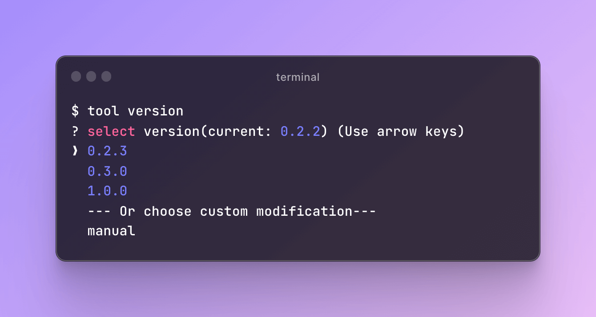

# termts

> termts is a collection that contains tiny and useful terminal script tools

node version need >= **14**

# install

```shell
# npm
npm install -g
# yarn
yarn install termts -g
# pnpm
pnpm add termts -g
```

# uses

**`tool banner <bannerUrl> [filepath] [title]`**  
Append a banner to the top of the markdown file. If there is no path parameter, the README.md file will be searched for in the current execution directory.

```shell
tool banner https://picsum.photos/879/876 --title=title --path=./yourpath/README.md
```

example:  
origin README.md

```markdown
# Demo
```

after:

```markdown
<div align="center">
    
    <h1>title</h1>
</div>

# Demo
```

**`tool version`**  
update version field of package interactively in the current directory


