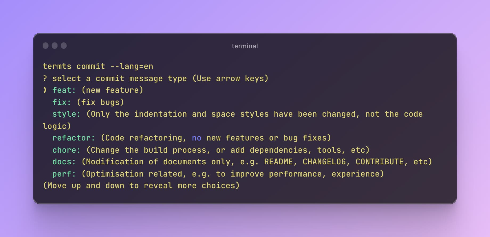

<div align="center">
  
  <h1 align="left">termts</h1>
</div>

> termts is a collection that contains tiny and useful terminal script termts

node version need >= **14**

English | [简体中文](README-ZH.md)

# install

```shell
# npm
npm install -g
# yarn
yarn install termts -g
# pnpm
pnpm add termts -g
```

# uses

tips: now(version > 0.0.9), you can use `tt` or `termts` to trigger commands

**`termts banner <bannerUrl> [path] [title] [align] [size]`**  
Append a banner to the top of the markdown file.

- **path** the path of `README.md` file. if there is no path parameter, the README.md file will be searched for in the current execution directory.
- **title** will render title if passed
- **align** supports `center`, `left` and `right`
- **size** the width of banner image. default is 320px

```shell
termts banner https://picsum.photos/987/496 --path=./yourpath/README.md --title="banner" --align=left --size=100%
```

example:  
origin README.md

```markdown
# Demo
```

after:

```markdown
<div align="left">
    
    <h1>banner</h1>
  </div>
  
# Demo
```


**`termts version`**  
update version field of package interactively in the current directory


**`termts commit [lang=zh|en]`**  
shortcut of `git commit -m`. support Chinese(--lang=zh) and English(--lang=en). Default is zh

 use --lang param to set language, default is Chinese



**`termts tree [dir] [deep] [ignore]`**  
output the tree structure of the specified directory

- **dir** the target directory. default is current working directory
- **deep** the depth of the catalogue. default is 1
- **ignore** ignored **first level** list. default is `node_modules` and `.git`

```shell
termts tree --dir=./termts --deep=2 --ignore lib
```

above will output the tree structure of termts project without lib directory


**termts ls**  
display the contents of the current directory. like ls in linux  
tips: more suitable for window systems requiring tiled output


**repo**  
open the repository of current project on your default browser
